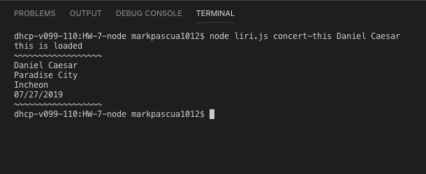
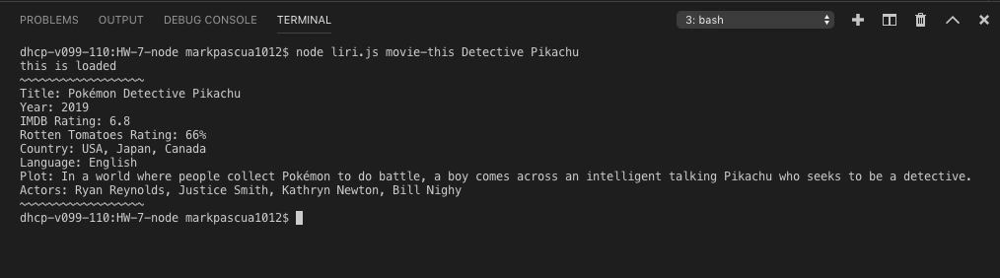
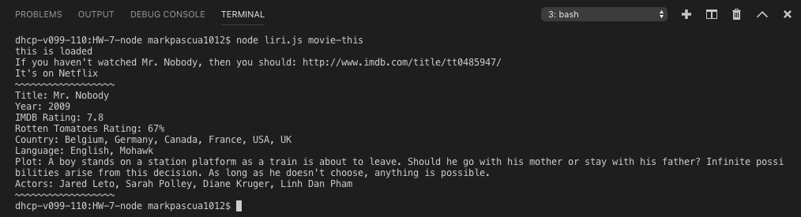
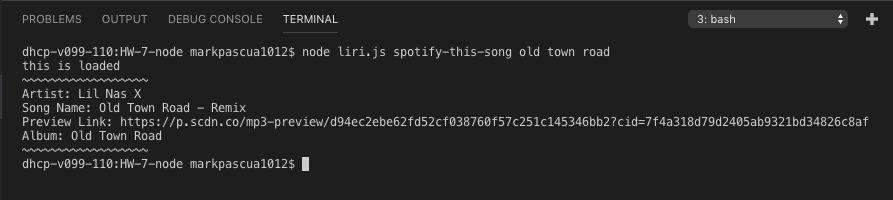
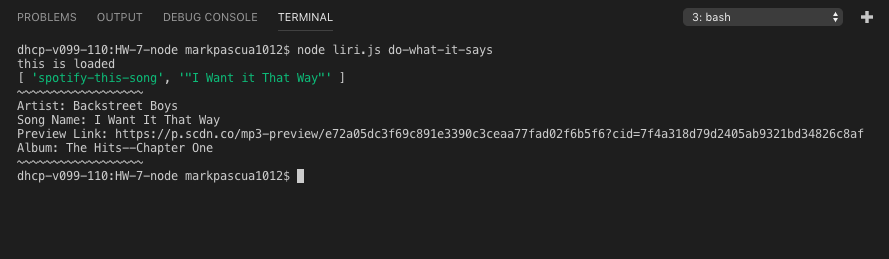
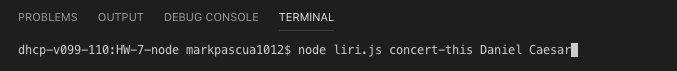
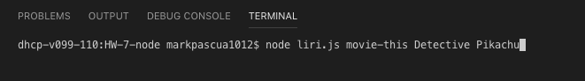
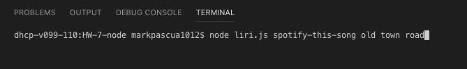

# LiriBot App

# What this app uses
* javascrpit
* node.js
* axios
* fs
* moment
* dotenv
* node-spotify-api
* bands in town api
* OMDB api

# What this app does
* Takes in an input of a music artist and uses the bands in town api to output their concert venue, city and date.

* Takes in an input of a movie title and uses OMDB api to output title, year, imdb rating, rotten tomatoes rating, country, plot,
and actors. 

* if no input is given it will output "Mr.Nobody"

* Takes in an input of a song title and uses node-spotify-api to output the song's artist, song name, preview link, and album.

* It also uses fs to output from a random.txt file which is prewritten with "I Want it That Way" and outputs
using the spotify function.

# How to use this app

* You must first open the app in your terminal

* To search concert you must input "node liri.js concert-this (artist name)"

* To search movie you must input "node liri.js movie-this (movie name)"

* To search song through spotify you must input "node liri.js spotify-this-song (song name)"

* To access the "random.txt" file you must input "node liri.js do-what-it-says"

